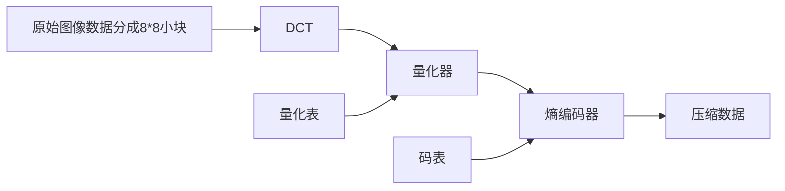
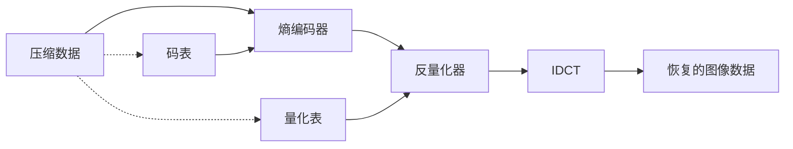

# 《数字图像处理学》中的基础概念与课后习题总结

在此对阮秋琦著的《数字图像处理学》（第三版）中的部分基础概念及习题进行总结。
<!--more-->  

# 第一章 绪论

## 本章内容

### 图像处理技术的分类

1. **模拟图像处理**：包括光学处理（利用透镜）和电子处理，如照相、遥感图像处理、电视信号处理等。速度快，但精度、灵活性较差。
2. **数字图像处理**：一般都用计算机处理或实时的硬件处理。精度高，但处理速度还有待提高。

### 数字图像处理的特点

1. **图像信息量大**

   一幅图像每个像素的灰度级至少要用$6\ bit$表示，一般采用$8\ bit$（彩色图像），高精度的可用$12\ bit$或$16\ bit$。一般分辨率的图像像素数为$256\times 256$像素、$512\times 512$像素，高分辨率图像可达$1024\times 1024$像素或$2048\times 2048$像素。

2. **图像处理技术综合性强**

   数字图像处理中涉及的基础知识和专业技术相当广泛。一般来说涉及通信技术、计算机技术、电子技术、电视技术，至于涉及的数学、物理等方面的基础知识就更多。

3. **图像信息理论与通信理论密切相关**

   图像理论是把通信中的一维时间问题推广到二维空间上来研究的。通信研究的是一维时间信息，是时间域和频率域的问题；图像研究的是二维空间信息，是空间域和空间频率域（或变换域）之间的关系。

### 数字图像处理方法

*见思考题1*

### 数字图像处理的主要内容

*见思考题3*

### 数字图像处理的硬件设备

一般的数字图像处理系统如下所示：
$$
\begin{aligned}
输入设备\rightarrow A/D（模拟数字转换器） \rightarrow &计算机 \rightarrow D/A（数字模拟转换器） \rightarrow 图像显示器 \\
& \uparrow\downarrow\\
&键盘监视器
\end{aligned}
$$
早期的数字图像处理系统为提高处理速度，增加容量，都采用**大型机**，后来较普遍发展**小型机**为主的系统。

现在的图像处理系统向**微型图像处理系统**和**大型机**两个方向发展。

要从根本上解决处理能力、速度与数据量巨大的问题，还应该发展**阵列机**和**并行处理技术**。

### 数字图像处理的应用

*见思考题7*

### 数字图像处理领域的发展动向

*见思考题8*

## 思考题

### 1. 图像处理的主要方法分几大类？

数字图像处理方法大致可分为两大类，即空域法和变换域法。

1. **空域法**

   把图像视为平面中各个像素组成的集合，然后直接对这个二维函数进行相应的处理。

   空域处理法主要有两大类：

   - **邻域处理法**

     梯度运算、拉普拉斯算子运算、平滑算子运算和卷积运算等。

   - **点处理法**

     灰度处理，面积、周长、体积和重心运算等。

2. **变换域法**

   首先对图像进行正交变换，得到变换域系数阵列，然后再施各种处理，处理后再将其反变换到空间域，得到处理结果。

   包括滤波、数据压缩、特征提取等处理。

### 2. 图像处理工程包括哪几项内容？

完整的数字图像处理工程大体上可分为：

1. 图像信息的**获取**
2. 图像信息的**存储**
3. 图像信息的**传送**
4. 图像信息的**处理**
5. 图像信息的**输出与显示**

### 3. 数字图像处理的主要内容是什么？试说明它们的基本用途。

数字图像处理概括地说，主要包括：

1. **几何处理**

   坐标变换，图像的放大、缩小、旋转、移动，多个图像配准，全景畸变校正，扭曲校正，周长、面积、体积计算等。

   其中图像配准涉及众多的数学变换问题，在医学图像处理中具有重要的应用价值。

2. **算术处理**

   对图像施以加、减、乘、除等运算。

   如医学图像的减影处理有显著的效果。

3. **图像增强**

   突出图像中感兴趣的信息，而减弱或去除不需要的信息，从而使有用信息得到加强，便于区分或解释。

   主要方法包括直方图修改技术、伪彩色增强法、灰度窗口、图像平滑、图像尖锐化处理、同态处理等技术。

4. **图像复原**

   去掉干扰和模糊，恢复图像的本来面目。

   典型的例子如去噪就属于复原处理。

5. **图像重建**

   以上四项都是从图像到图像的处理，而重建是从数据到图像的处理，即输入的是某种数据，而处理结果得到的是图像。

   该处理的典型应用就是CT技术，早期为X光CT，后来发展有ECT、超声CT、核磁共振（NMR）等。

6. **图像编码**

   主要宗旨是利用图像信号的统计特性及人类视觉的生理学及心理学特性对图像信号进行高效编码，即研究数据压缩技术，以解决数据量大的矛盾。一般来说，图像编码的目的有三个：

   - 减少数据存储量
   - 降低数据率以减少传输带宽
   - 压缩信息量，便于特征抽取，为识别做准备

7. **图像识别**

   图像模式识别方法大致有三种：

   - 统计识别法：侧重于特征

     统计决策理论的基本思想就是在不同的模式类中建立一个决策边界，利用决策函数把一个给定的模式归入相应的模式类中。

   - 句法结构模式识别法：侧重于结构和基元

     如英文句子由一些短语，短语又由单词，单词又由字母构成一样。用一组模式基元和它们的组成来描述模式的结构的语言，称为模式描述语言。支配基元组成模式的规则称为文法。当每个基元被识别后，利用句法分析就可以作出整个的模式识别。即以这个句子是否符合某特定文法，以判别它是否属于某一类别。这就是句法模式识别的基本思想。

   - 模糊识别法：把模糊数学的一些概念和理论用于识别处理。

8. **图像理解**

   由模式识别发展起来的方法，输入图像，输出一种描述。

### 4. 什么是图像显示中的硬拷贝和软拷贝？它们主要用什么设备？

硬拷贝是二维地保持被压缩信息的板状物体实体，当资料经由印表机输出至纸上称为硬拷贝。而软拷贝则表示另有存储（记忆） 的不可见信息，若资料显示在萤幕上则称为软拷贝。

通常的硬拷贝方法有**照相**、**激光拷贝**、**彩色喷墨打印机**等几种方法。

软拷贝方法有以下几种：

1. **CRT显示**
2. **液晶显示器LCD**
3. **彩色等离子显示技术PDP**
4. **场致发光显示器FED**

### 5. 图像信息获取设备有哪几种？其优缺点是什么？

图像信息获取这一过程主要包括摄取图像、光电转换及数字化等几个步骤。通常图像获取的方法有如下几种：

1. **电视摄像机**
   - 优点：设备小巧、速度快、成本低、灵敏度高；
   - 缺点：灰度层次较差、非线性失真较大、有黑板效应、在使用中需校正。

2. **飞点扫描器**
   - 优点：可获得与电视摄像机相仿的扫描速度，但位置进度和分辨率都比电视摄像机高，图像清晰，可透射成像也可反射成像；
   - 缺点：稳定性和再现性比较差，体积略显庞大，设备价格也较高。
3. **扫描鼓**
   - 优点：扫描精度高、信噪比高、可靠性，速度比平台式位密度计要快得多，既可以输入也可以输出；
   - 缺点：只能采用逐行扫描方式，不能用于随机扫描，同时价格昂贵，维护要求高。
4. **扫描仪**
   - 优点：成本很低；
   - 缺点：速度较慢，精度一般。
5. **微光密度计**
   - 优点：精度很高；
   - 缺点：速度很慢、价格昂贵。

### 6. 图像显示的主要方法有几种？其特点什么？

1. **硬拷贝**：照相、激光拷贝、彩色喷墨打印等。

2. **软拷贝**：

   - CRT显示：显示质量好、亮度高、电子束寻址方式简单，成本低。
   - 液晶显示器LCD
   - 彩色等离子显示技术PDP：大面积显示、全色显示、对比度高、色纯度好、寿命长、工作电压低、易于批量生产。
   - 场致发光显示器

### 7. 数字图像处理有哪些应用？试举出几种你见过的应用。

其典型的应用领域如下：

1. **遥感**

   土地测绘、资源调查、气象监测、环境污染监测、农作物估产、军事侦察等。

2. **医学**

   X光CT、电阻抗断层图像技术（或阻抗成像）等。

3. **通信**

   电视广播、可视电话和会议电话、传真、图文电视和可视图文等。

4. **工业生产的质量控制**

   产品及部件的无损检测（食品包装、玻璃质量、工件尺寸测量和铁谱分析等）。

5. **安全保障、公安等方面的应用**

   采用模式识别等方法实现监控、指纹档案、案件侦破、交通管理等。

6. **教学、科研领域**

   科学计算可视化技术、远程培训等。

7. **电子商务**

   身份认证、产品防伪、水印技术等。

### 8. 数字图像处理的发展方向是什么？

图像处理技术未来发展大致归纳如下4点：

1. **高速、高分辨率和立体化**
2. **三维成像和多维成像**
3. **硬件芯片研究**
4. **新理论与算法研究**


# 第二章 图像、图像系统与视觉结构

## 本章内容

### 光学预备知识

*见思考题1*

### 图像信息的分类

1. **符号信息**

   一般是用文字、符号、图形等表示的具体的或抽象的事物。

2. **景物信息**

   能给人以主观感觉但不取决于人本身的客观场景信息。

3. **情绪信息**

   是一种依赖于受信者的图像信息，不仅能给人以直观感觉，而且能以其特殊的艺术内容刺激人的感官。

### 图像的统计特性

*见思考题2*

### 图像信息的信息量

#### 离散的图像信息的熵

一幅图像如果有$s1,s2,s3,\cdots,s_q$共$q$种幅度值，并且出现的概率分别为$P_1,P_2,P_3,\cdots,P_q$，那么每一种幅度值所具有的信息量分别为$\log_2(\frac{1}{P_1}).\log_2(\frac{1}{P_2}),\log_2(\frac{1}{P_3}),\cdots,\log_2(\frac{1}{P_q})$。由此，其平均信息量（熵）可由下式表示：
$$
H=\sum_{i=1}^{q}P_i\log_2\frac{1}{P_i}=-\sum_{i=1}^{q}P_i\log_2{P_i}
$$

#### 连续的图像信息的熵

$$
H=\int_{-\infty}^{\infty}p(s)\log_2{\frac{1}{p(s)}}ds+\infty
$$

一般忽略第二项：
$$
H=-\int_{-\infty}^{\infty}p(s)\log_2{p(s)}ds
$$
其中$p(s)$是概率密度。

连续图像的熵并不是绝对熵，而是绝对熵减去一个无限大项，可以说这是一个相对熵。

### 常用图像格式

- **BMP**：点阵图像格式之一。
- **PCX**：MS-DOS下常用的格式。
- **GIF**：为数据流而设计的一种传输格式，不是作为文件存储的格式。
- **JPEG**：有损压缩格式，能够将图像压缩在很小的储存空间。
- **TIF(F)**：主要在应用程序和计算机平台之间交换文件。
- **GEM**：通常用.IMG为扩展名，由文件头和后面的图像数据组成。
- **PBM**：包括了读写许多其他位图文件格式的程序，以及对图像完成变换的实用程序。
- **PSD**：Adobe Photoshop的专用图像格式，可以以RGB或CMYK彩色模式储存。
- **PCD**：Photo CD专用存储格式，文件特别大，需要存在CD-ROM上。
- **WMF**：微软公司开发的矢量图形格式

### 常用输入设备

- **电视摄像机**
- **飞点扫描设备**
- **鼓形扫描器**
- **微密度计**

### 常用输出设备

- **监视器**
- **激光扫描器**
- **液晶显示器**
- **等离子体PDP显示技术**
- **数码纸显示技术**
- **其他图像显示装置**
  - **彩色打印机**
  - **投影显示器**
  - **其他平板显示**

### 视觉系统的基本构造

人的视觉系统由**眼球**、**神经系统**及**大脑的视觉中枢**构成。

### 颜色的表示方法及观察条件

颜色的表示方法大体上有两种方法。

1. 设置一套作为标准的颜色样本，被试的颜色与样本进行比较，然后用特殊的记号来表示。

2. 取决于刺激光的物理性质和色的感觉的对应关系。（心理物理色）

### 三基色混色及色度表示原理

*见思考题18、19*

### CIE的R、G、B颜色表示系统

国际照明委员会（CIE）选择红色（波长$\lambda=700.00\ nm$），绿色（波长$\lambda=546.1\ nm$），蓝色（波长$\lambda=438.8\ nm$）三种单色光作为表色系统的三基色。

产生$1\ lm$白光需要的三基色的近似值可用下面的亮度方程来表示：
$$
1\ lm(White)=0.30\ lm(Red)+0.59\ lm(Green)+0.11\ lm(Blue)
$$
产生白光时三基色比例关系不等，可以使用$T$单位制：
$$
1\ lm(W)=1\ T(R)+1\ T(G)+1\ T(B)
$$
可见$1\ T$单位红光$=0.30\ lm$，$1\ T$单位绿光$=0.59\ lm$，$1\ T$单位蓝光$=0.11\ lm$。

### 刺激强度与感觉的关系

关于刺激光的强度和颜色的感觉，由于较暗的情况下只有杆状体起作用，所以此时并没有颜色感觉。亮度达到$10^{-3}\ cd/m^2$时锥状体才起作用，也就是亮度达到所谓微明视觉的水平时才有色觉。

### 亮度适应和颜色适应

从较亮的场所到较暗的场所时，很难马上看到东西，相反，从较暗的场所到较亮的场所，也看不见东西。一般把眼睛的状态适应明暗条件的变化叫做亮度适应。从亮到暗的变化叫做暗适应；从暗到亮的变化叫做亮适应。

与亮度适应相区别，随着光的分布而变化，眼睛对颜色刺激灵敏度变化的性质。例如，用强红光刺激眼睛后看本来是黄色的物体确实绿色的。这种依赖光分布的视觉灵敏度叫做色适应。

### 亮度对比和颜色对比

一般情况，在相同亮度的刺激下，背景亮度的不同所感觉到的明暗程度也不同。

刺激的亮度和色度受周围背景的影响而使其产生不同感觉的现象叫做同时对比现象。这里包括亮度对比和颜色对比。

关于对比效果的基尔希曼法则：

1. 目标比背景小，颜色对比大；
2. 颜色对比在空间分离的两个领域内也发生，间隔大时则效果较小；
3. 背景大，对比量也大；
4. 明暗对比最小时，颜色对比最大；
5. 明暗相同时，背景色度高对比量大；
6. 亮度及颜色的恒定性（白天的煤山亮度比夜间的雪山亮度高，但仍感觉煤山黑，雪山白）。

### 颜色感觉与刺激面积的关系

*见思考题21（第三色盲）*

### 主观颜色

一个一半黑一半白的圆板，当它旋转时，将看到色度较低的颜色。这个现象不能用刺激光的分光特性来预测。圆板缓慢旋转时，从圆心到最外圈将看到不同的颜色。

### 记忆色

我们经常接触的物体，对它的特有的颜色会有记忆，这就是记忆色的概念。例如人的皮肤颜色、草木的颜色等很容易从颜色样本中选出来，这是人人都有的视觉倾向。

但是一般来说，记忆色与实际颜色并不一样，记忆色的色度和亮度都比实际颜色要高。记忆色与理想颜色的再现关系密切，无论是在彩色电视技术上还是绘画上都受到广泛的关注。

### 进入色、后退色、膨胀色、收缩色

观察物体时，根据其颜色有的感觉较近，有的感觉较远。使人有拉近距离感觉的颜色称为进入色，它有较长的波长。看着有推远距离感觉的颜色称为后退色，它有较短的波长。

另外，有的颜色使我们有物体变大的感觉，称为膨胀色。有的会有缩小的感觉，称为收缩色。这些特性又与亮度有关。亮度高的黄色有增大的感觉，亮度低的蓝色有缩小的感觉。除此外，还有暖色、冷色等。

### 错视的原因

视觉系统对形状的感受受到物体自身形状及周围背景的影响。这类影响有神经系统引起的错视现象也有心理学因素的作用。

当出示几个图形时，互相接近的人之间对图形的感觉比较容易取得一致的看法，这里就包括有心理上的诱导作用（群化法则）。另一个关系到心理因素的重要问题是图形和背景的关系问题，对图形和背景的感觉与观察者的经验、态度、明暗差别以及面积的比例等各种因素都有关系。

视觉对大小形状的感觉也有时间因素的影响。

当视网膜受到刺激时，并不是只有与刺激部位相对应的神经系统产生反应，而是对其周围也有影响，这种影响可以看成是由某种场引起的，所以把它叫做诱导场。利用诱导场的概念可以解释一些错视现象。

## 思考题

### 1. 光学中的主要计量单位有哪几个？它们的含义是什么？

1. **发光强度**（$I$）

   光源发光的功率，其单位主要有如下两种：

   - 烛光功率（Candle Power，$CP$）：1$CP$是指标准蜡烛发出的光
   - 新烛光（Candle，$cd$）：1$cd$是“全辐射体”加热到铂的熔点（$2024K$）时从一平方厘米表面面积上发出的光的$1/60$

2. **光通量**（$\Phi$）

   每秒钟内光流量的度量，其单位是流明（lumen，$lm$）。

   

3. **照度**（$E$）

   入射到某表面的光通量密度称为该表面的照度，用每单位面积的流明数来表示，主要单位有如下几种：

   - 公制单位：
     - 勒克斯（lx）
     - 辐透（phot）
     - 毫辐透（mphot）
   - 英制单位：
     - 英尺一烛光

4. **反射系数**（$\rho$）
   $$
   \rho=\frac{某表面反射的流明数}{入射到该表面的流明数}
   $$

5. **透射系数**（$\tau$）
   $$
   \tau=\frac{某物质透射的流明数}{入射到该物质的流明数}
   $$

6. **亮度**（$L$）

   用来说明物体表面发光的量度。

   亮度的衡量主要有A、B两组单位。

   - A组：使用新烛光（坎德拉）为单位
     - 尼特：1 尼特=1 新烛光/平方米
     - 熙提：1 熙提=1 新烛光/平方厘米
   - B组：使用流明数为单位
     - 亚熙提：1 亚熙提=1 流明/平方米
     - 郎伯：1 郎伯=1 流明/平方厘米

### 2. 图像的统计特性包括哪些内容？

1. **图像的振幅分布特性**
2. **差值信号的振幅分布特性**
3. **图像的自相关函数和空域功率谱**
4. **电视信号的数学表示及自相关函数**

### 17. 什么是光觉？什么是色觉？

眼睛对光的感觉称为光觉，对颜色的感觉称为色觉，这是眼睛的基本特性。

### 18. 什么是三基色？相加混色与相减混色的基色是否相同？

几乎所有的彩色都能由三种基本彩色混配出来，这三种彩色就叫做三基色。

由三基色混配各种颜色的方法通常有两种——**相加混色**和**相减混色**，二者主要的区别表现在以下：

1. 相加混色是由发光体发出的光相加而产生各种颜色，而相减混色是先有白色光，然后从中减去某些成分（吸收）得到各种彩光；
2. **相加混色的三基色是红、绿、蓝，而相减混色的三基色是黄、青、紫（一般不确切的说成是黄、蓝、红），即相加混色的补色就是相减混色的基色。**
3. 相加混色和相减混色有不同规律（颜料相混）。

### 19. 格拉斯曼定律包含哪些内容？

1. 所有颜色都可以用互相独立的三基色混合得到；
2. 假如三基色的混合比相等，则色调和色饱和度也相等；
3. 任意两种颜色相混合产生的新颜色与采用三基色分别合成这两种颜色的各自成分混合起来得到的结果相等；
4. 混合色的光亮度是原来各分量光亮度的总和。

色调、色饱和度及亮度是表示色觉程度的，色调表示各种颜色的种类，色饱和度表示颜色深浅。
$$
F\equiv R(R)+G(G)+B(B)
$$

### 21. 什么是第三色盲？它对图像处理有何意义？

对于一个色觉正常的人来说，颜色刺激面积非常小时就不能识别颜色了，这种色觉异常状态叫做第三色盲。有学者的研究结果表明，当面积较小时，橙、蓝、绿直线的感觉很接近，当更小时，就只有灰色的感觉了。这个原理被用到彩色电视机原理中，对减少传送频带做出了贡献。

### 22. 什么是视力？视力与哪些因素有关？

视力是指人眼分辨物体细微部分的能力，视力与以下因素有关：

1. **环境**

   不同的测试条件测得的视力值也不同。

2. **视网膜的不同部分**

   视力最好的部分在视线附近，即视网膜中央凹上，中央凹周围视力急剧下降。

3. **眼睛的光学系统**

   瞳孔较大时，因为成像的光行差时视力变低。但在极端情况下，瞳孔很小时视力也要下降。

4. **水晶体的调节状态**

   一般情况下，视距在$1\ m$以下时视距越小则视力降低越显著。此外照明亮度高或者测试卡与背景的对比度大则视力会提高。特别是测试标在运动的情况下，运动速度越快则视力越低。

### 23. 什么是马赫现象？它指什么而言？

马赫效应是一种**轮廓增强**现象。一幅明暗图像，一边亮一边暗，中间过渡是缓慢斜变的，当观看这样的图象时，视觉的感觉是亮的一边更亮，暗的一边更暗，同时靠近暗的一边的亮度比远离暗的一边要亮，而靠近亮的一边比远离亮的一边显得更暗。

### 24. 什么是光觉门限？

产生光的感觉必须有一定量的光进入眼睛，把产生光觉的最小亮度叫做光觉门限或光觉阈。

光觉门限的适应状态受生理条件、光的波长、光刺激的持续时间、刺激面积以及在视网膜上的位置等因素的影响。光觉门限的值大约为$1\times 10^{-6}\ cd/m^2$（尼特）。


# 第三章 图像处理中的正交变换

## 本章内容

### 傅里叶变换

#### 定义及基本概念

$$
\begin{aligned}
F(u)&=\int_{-\infty}^{\infty}f(x)e^{-j2\pi ux}dx \\
f(x)&=\int_{-\infty}^{\infty}F(u)e^{j2\pi ux}du
\end{aligned}
$$

$x$为时域变量，$u$为频率变量，令$\omega=2\pi u$：
$$
\begin{aligned}
F(u)&=\int_{-\infty}^{\infty}f(x)e^{-j\omega x}dx \\
f(x)&=\frac{1}{2\pi}\int_{-\infty}^{\infty}F(u)e^{j\omega x}d\omega
\end{aligned}
$$
$f(x)$的傅里叶变换一般是一个复量：
$$
F(\omega)=R(\omega)+jI(\omega)
$$
指数形式：
$$
F(\omega)=|F(\omega)|e^{j\phi(\omega)}
$$
其中，傅里叶幅度谱：
$$
|F(\omega)|=\sqrt{R^2(\omega)+I^2(\omega)}
$$
相位谱：
$$
\phi(w)=\arctan{\frac{I(\omega)}{R(\omega)}}
$$

#### 性质

- 可分性

一个二维傅里叶变换可用两次一维傅里叶变换实现。

- 线性

傅里叶变换是线性算子。

- 共轭对称性

对于$f(-x,-y)$傅里叶变换的共轭函数$F^*(-u,-v)$，有：
$$
F(u,v)=F^*(-u,-v)
$$

- 旋转性

若空间域函数旋转角度$\theta_0$，则在变换域中此函数的傅里叶变换也旋转同样的角度。

- 比例变换特性

$$
\begin{aligned}
af(x,y)&\Leftrightarrow aF(u,v) \\
f(ax,by)&\Leftrightarrow\frac{1}{|ab|}F(\frac{u}{a},\frac{v}{b})
\end{aligned}
$$

- 帕斯维尔定理（能量保持定理）

$$
\int_{-\infty}^{\infty}\int_{-\infty}^{\infty}|f(x,y)|^2dxdy=\int_{-\infty}^{\infty}\int_{-\infty}^{\infty}|F(u,v)|^2dudv
$$

- 相关定理

- 卷积定理

### 离散傅里叶变换（DFT）

#### 定义

$$
\begin{aligned}
X(m)&=\sum_{n=-\infty}^{\infty}x(n)e^{-j2\pi mn} \\
x(n)&=\sum_{n=-\infty}^{\infty}X(m)e^{j2\pi mn}
\end{aligned}
$$

#### 性质

- 线性

$$
ax(n)+by(n)\Leftrightarrow aX(m)+bY(m)
$$

- 对称性

$$
\frac{1}{N}X(n)\Leftrightarrow x(-m)
$$

- 时间移位

- 频率移位
- 周期性
- 偶函数
- 奇函数
- 卷积定理
- 相关定理
- 帕斯维尔定理

### 快速傅里叶变换（FFT）

在分析离散傅里叶变换中的多余运算之上，进而消除这些重复工作的思想指导下得到的。

把原始的$N$点序列依次分解为一系列短序列，然后求出这些短序列的离散傅里叶变换，以此减少乘法运算。
$$
X(m)=X_1(m)+W_N^mX_2(m)\quad m=0,1,\cdots,N-1
$$
一个$N$点的离散傅里叶变换可由两个$N/2$点的傅里叶变换得到，离散傅里叶变换的计算时间主要由乘法决定，当$N$是$2$的整数幂时，上式中$X_1(m)$和$X_2(m)$还可以再分成两个更短的序列。利用系数矩阵$W_N^m$的周期性和分解运算，从而减少乘法运算次数是实现快速运算的关键。

FFT算法根据分解的特点一般有两类，一类是按时间分解，一类是按频率分解。

### 离散余弦变换（DCT）

#### 定义

**一维离散余弦变换**的定义：
$$
\begin{aligned}
F(0)&=\frac{1}{\sqrt{N}}\sum_{x=0}^{N-1}f(x) \\
F(u)&=\sqrt{\frac{2}{N}}\sum_{x=0}^{N-1}f(x)cos\frac{(2x+1)u\pi}{2N}
\end{aligned}
$$
其中，$F(u)$是第$u$个余弦变换系数，$u$是广义频率变量，$u=1,2,3,\cdots,N-1$；$f(x)$是时域$N$点序列，$x=0,1,\cdots,N-1$。
$$
\begin{bmatrix}
F(0) \\
F(1) \\
F(2) \\
F(3)
\end{bmatrix}
=
\begin{bmatrix}
\cdot & \cdot & \cdot & \cdot \\
\cdot & \cdot & \cdot & \cdot \\
\cdot & \cdot & \cdot & \cdot \\
\cdot & \cdot & \cdot & \cdot \\
\end{bmatrix}
\cdot
\begin{bmatrix}
f(0) \\
f(1) \\
f(2) \\
f(3)
\end{bmatrix}
$$
即：
$$
\begin{aligned}
F(u)&=Af(x) \\
f(x)&=A^TF(u)
\end{aligned}
$$
**二维离散余弦变换**矩阵式：
$$
\begin{aligned}
F(u,v)&=Af(x,y)A^T \\
f(x,y)&=A^TF(u,v)A
\end{aligned}
$$

#### 离散余弦变换的正交性

$$
AA^T=I
$$

### 沃尔什变换

离散傅里叶变换和余弦变换在快速算法中都要用到复数乘法，占用的时间仍然比较多，在某些领域需要更为便利更为有效的变换方法。

### 离散沃尔什变换

*TODO..*

### 哈尔函数及哈尔变换

*TODO..*

### 斜矩阵与斜变换

*TODO..*


### 小波变换

*TODO..*


# 第四章 图像增强

## 本章内容

### 直方图

*见思考题2*

### 直方图修改技术的基础

*见思考题3*

### 用直方图修改技术进行图像增强

#### 直方图均衡化处理

以累计分布函数变换法为基础的直方图修正法，变换函数：
$$
s=T(r)=\int_0^rp_r(w)dw
$$
则：
$$
\begin{aligned}
p_r(s)&=[p_r(r)\cdot\frac{dr}{ds}]_{r=T^{-1}(s)} \\
&= [p_r(r)\cdot\frac{1}{\frac{ds}{dr}}]_{r=T^{-1}(s)}\\
&=[p_r(r)\cdot\frac{1}{p_r(r)}] = 1
\end{aligned}
$$
变换后的图像灰度级服从均匀分布，即得到一幅灰度层次较为适中的图像。

#### 直方图规定化处理

在不同的情况下，并非总需要具有均匀直方图的图像，有时需要具有特定的直方图的图像，以便能够对图像中的某些灰度级加以增强。

对于原始图像和所希望得到的图像（假设已经得到）都做直方图均衡化处理：
$$
\begin{aligned}
s&=T(r)=\int_0^rp_r(w)dw \\
u&=G(z)=\int_0^zp_z(w)dw
\end{aligned}
$$
同样做了均衡化处理，$p_s(s)$和$p_u(u)$具有同样的均匀密度。根据上式的逆过程，用$s$来代替$u$有：
$$
z=G^{-1}(u)\approx G^{-1}(s)
$$
则：
$$
z\approx G^{-1}[T(r)]
$$

#### 图像对比度处理

图像的亮度范围不足或非线性会使图像的对比度不理想，可用像素幅值重新分配的方法来改善图像对比度。扩大图像亮度范围可以用**线性映射**的方法。

### 图像平滑化处理

#### 邻域平均法

$$
g(x,y)=\frac{1}{M}\sum_{(m,n)\in S}f(m,n)
$$

采用阈值法可以减少由于邻域平均所产生的模糊效应：
$$
g(x,y)=
\begin{cases}
\frac{1}{M}\sum_{(m,n)\in S}f(m,n),\quad &若|f(x,y)-|\frac{1}{M}\sum_{(m,n)\in S}f(m,n)|\gt T \\
f(x,y),&其他
\end{cases}
$$
即当一些点和它的邻域内点的灰度的平均值的差不超过规定的阈值时，保留原灰度值不变。

#### 低通滤波法

$$
G(u,v)=H(u,v)\cdot F(u,v)
$$

*见思考题15*

#### 多图像平均法

加性噪声，与坐标不相关，且平均值为零。
$$
\bar{g}(x,y)=\frac{1}{M}\sum_{j=1}^Mg_j(x,y)
$$
*见思考题16*

### 图像尖锐化处理

*见思考题17*

### 利用同态系统进行增强处理

*见思考题19*

### 伪彩色图像处理

1. **等密度分层伪彩色技术**

   可以用专用硬件实现，照相技术中一幅照片的浓淡层次由底片上银粒的沉积度决定，照片的反差直接与密度有关。

2. **灰度分割**

   若一幅图像可被看作为二维亮度函数（$x,y,f(x,y)$），用一些平行于图像坐标平面的平面，每一平面在与函数相交处分割函数。一次分割将产生一个两色图像，多分层过程类似。

   例如$16$级分层，通过编码器得到四位码，加到红、绿、蓝、亮度四个通道中即可得到不同的色调，颜色与码的关系可以人为改变，例如：

   - 0000：黑色
   - 0001：紫色
   - 0010：粉红色
   - ...
   - 1110：深蓝色
   - 1111白色

3. **灰度级转换为彩色**

   对输入像素的灰度级进行三个相互独立的转换，然后将三个结果分别送到彩色监视器的红、绿、蓝的电子发射枪上。这是对图像的灰度级值的转换，而不是位置的函数。
   $$
   \begin{aligned}
   &\nearrow 红转换 \rightarrow I_R(x,y) \\
   f(x,y)&\rightarrow 绿转换 \rightarrow I_G(x,y)\\
   &\searrow 蓝转换 \rightarrow I_B(x,y)
   \end{aligned}
   $$

4. **一种滤波处理**

   前面几种为灰度 - 彩色变换方法，实际应用中也可以针对图像中不同频率成分加以彩色增强，以便更有利于抽取频率信息。
   $$
   \begin{aligned}
   &\nearrow 滤波器 \rightarrow 傅里叶反变换 \rightarrow 附加处理 \searrow \\
   \rightarrow 傅里叶变换 &\rightarrow 滤波器 \rightarrow 傅里叶反变换\rightarrow 附加处理 \rightarrow 彩色监视器\\
   &\searrow 滤波器 \rightarrow 傅里叶反变换\rightarrow 附加处理 \nearrow
   \end{aligned}
   $$

## 思考题

### 1. 图像增强的目的是什么？

图像增强是按特定的需要突出一幅图像中的某些信息，同时削弱或去除某些不重要的信息的处理方法。其主要目的是**使处理后的图像对某种特定的应用来说，比原始图像更适用**。因此这类处理是为了某种应用而去改善图像质量的。处理的结果使图像更适合于人的视觉特性或机器的识别系统。

增强处理并不能增强原始图像的信息，其结果只能增强对某种信息的辨别能力，而这种处理有可能损失一些其他信息。

图像增强技术主要包括直方图修改处理、图像平滑化处理、图像尖锐化处理以及彩色处理技术等。

### 2. 什么是直方图？

灰度级的直方图是反映一幅图像中的灰度级与出现这种灰度的概率之间关系的图形。

图像中，像素的灰度级可作归一化处理：$0\le r\le 1$。

$r$是一个随机变量，假定对每一瞬间它们是连续的随机变量，用概率密度函数$p_r(r)$来表示原始图像的灰度分布。横轴代表灰度级$r$，纵轴代表灰度级的概率密度$p_r(r)$。从图像的灰度级分布可以看出一幅图像的灰度分布特性。

引入离散形式，$r_k$代表灰度级，$P_r(r_k)$代替$p_r(r)$，则有：
$$
\begin{aligned}
P_r(r_k)=&\frac{n_k(出现r_k这种灰度的像素数)}{n(图像中的像素总数)}(频数) \\ 
&\quad \quad0\le r_k \le 1 \quad k=0,1,2,\cdots,l-1
\end{aligned}
$$
$r_k$与$P_r(r_k)$的关系图形称为灰度级的直方图。

### 3. 直方图修改的技术基础是什么？/ 4. 在直方图修改技术中采用的变换函数的基本要求是什么？/ 5. 直方图均衡化采用何种变换函数？/ 6. 直方图均衡化处理的结果是什么？

一幅图像，$0\le r \le 1$，对$[0,1]$区间内的任一个$r$做如下变换：
$$
s=T(r)
$$
$T(r)$应满足：

1. $0\le r \le 1$内，$T(r)$单值单增（保证灰度级从白到黑的次序不变）；
2. 对于$0\le r \le 1$，$0\le T(r) \le 1$（灰度值在允许范围内）。

反变换为：
$$
r=T^{-1}(s)
$$
已知随机变量$\xi$的概率密度$p_r(r)$，而随机变量$\eta$是$\xi$的函数，即$\eta=T(\xi)$，$\eta$的概率密度为$p_s(s)$，则可由$p_r(r)$求出$p_s(s)$。

$s=T(r)$单增可得$r=T^{-1}(s)$单增，则$\eta\lt s$仅当$\xi \lt r$时发生，则：
$$
F_\eta(s)=P(\eta\lt s)=P(\xi\lt r)=\int_{-\infty}^rP_r(x)dx
$$
两端求导即可得到$\eta$的密度函数$p_s(s)$。
$$
p_s(s)=\cdots=[p_r(r)\cdot\frac{dr}{ds}]_{r=T^{-1}(s)}
$$

### 11. 什么是“简并”现象？如何克服“简并”现象？

直方图均衡化变换后的灰度级会减少，叫做“简并”现象，这是像素灰度有限的必然结果。

减少简并现象的简单方法是**增加像素的比特数**，从而减少灰度层次的损失。另外采用**灰度间隔放大理论**的直方图修正法也可以减少简并现象，这种灰度间隔放大可以按照眼睛的对比度灵敏度特性和成像系统的动态范围进行放大。

### 12. 直方图规定化处理的技术难点是什么？如何解决？

利用直方图规定化方法进行图像增强的主要困难在于如何构成有意义的直方图。一般有两种方法，一种是给定一个规定的概率密度函数，若高斯、瑞利等函数。另一种方法是规定一个任意可控制的直方图，其形状可由一些直线所组成，得到希望的形状后，将这个函数数字化。

### 14. 在邻域平均法处理中如何选取邻域？

1. 半径=$\Delta{x}$
   $$
   \begin{bmatrix}
   \circ & \bullet & \circ \\
   \bullet & \cdot & \bullet \\
   \circ & \bullet & \circ
   \end{bmatrix}
   $$

2. 半径=$\sqrt{2}\Delta{x}$
   $$
   \begin{bmatrix}
   \bullet & \bullet & \bullet \\
   \bullet & \cdot & \bullet \\
   \bullet & \bullet & \bullet
   \end{bmatrix}
   $$

### 15. 低通滤波法图像增强处理中通常有几种滤波器？它们的特点是什么？

1. **理想低通滤波器**

   处理过程会产生较严重的**模糊和振铃现象**，这种现象是傅里叶变换的性质决定的。

2. **布特沃斯低通滤波器**

   由于它的$H(u,v)$不是陡峭的截止特性，它的**尾部会包含有大量的高频成分**。且由于在滤波器的通带和阻带之间有一平滑过渡的缘故，经布特沃斯低通滤波器处理的图像将**不会有振铃现象**。

3. **指数低通滤波器**

   经指数低通滤波器处理的图像**比布特沃斯低通滤波器处理的图像稍模糊一些**，由于指数低通滤波器的传递函数也有较平滑的过渡带，所以图像中也**没有振铃现象**。

4. **梯形低通滤波器**

   梯形低通滤波器的传递函数特性**介于理想低通滤波器和具有平滑过渡带的低通滤波器之间**，其处理效果也介于这两者中间。结果**有一定的振铃现象**。

详细参考：[数字图像处理#频率域高通（锐化）滤波器](https://meurice.xyz/posts/6acabff5.html#频率域高通（锐化）滤波器)

### 16. 多图像平均法为何能去掉噪声？它的主要难点是什么？

取$M$辐内容相同但含不同噪声（加性噪声，平均值零）的图像叠加，不难得出：
$$
\begin{aligned}
E\{\bar{g}(x,y)\}&=f(x,y) \\
\sigma^2_{\bar{g}(x,y)}&=\frac{1}{M}\sigma^2_{n(x,y)} \\
\sigma_{\bar{g}(x,y)}&=\frac{1}{\sqrt{M}}\sigma_{n(x,y)}
\end{aligned}
$$
做平均处理的含噪声图像数目增加时，其统计平均值越接近原始无噪声图像。

这种方法在实际应用中的最大困难在于把多幅图像配准起来，以便使相应的像素能正确地对应排列。

### 17. 图像尖锐化处理有几种方法？

1. **微分尖锐化处理**
2. **零交叉边缘检测**
3. **Canny算子**
4. **经典的Kirsch算子**
5. **高通滤波法**

### 18. 零交叉边缘检测的优点是什么？

对图像的二维卷积可简化为两个一维卷积，是最佳边缘检测器之一。 

### 19. 何为同态处理？试述其基本原理。

是把频率过滤和灰度变换结合起来的一种处理方法。它是把图像的照射、反射模型作为频域处理的基础，利用压缩高亮范围和增强对比度来改善图像的一种处理技术。

### 21. 在图像处理中有哪几种模型？它们的应用对象是什么？

1. **RGB**彩色模型：**彩色监视器和彩色摄像机等领域**

2. **CMY**彩色模型：**彩色打印机**

   蓝绿（青，Cyan）、红紫（紫，Magenta）、黄（Yellow）
   $$
   \begin{bmatrix}
   C \\
   M \\
   Y 
   \end{bmatrix}
   =
   \begin{bmatrix}
   1 \\
   1 \\
   1 
   \end{bmatrix}
   -
   \begin{bmatrix}
   R \\
   G \\
   B 
   \end{bmatrix}
   $$

3. **YIQ**彩色模型：**彩色电视广播**

   是一个RGB的编码
   $$
   \begin{bmatrix}
   Y \\
   I \\
   Q 
   \end{bmatrix}
   =
   \begin{bmatrix}
   0.299 & 0.587 & 0.114 \\
   0.596 & -0.275 & -0.321 \\
   0.212 & -0.523 & 0.311
   \end{bmatrix}
   \begin{bmatrix}
   R \\
   G \\
   B 
   \end{bmatrix}
   $$

4. **HSI**彩色模型：**实用系统**（自动判断水果成熟度的图像处理系统）

   色调（Hue）、饱和度（Saturation）、亮度（Intensity）
   
   
   

# 第五章 图像编码

## 本章内容

### 行程编码

是一种无损编码。

#### 一维行程编码

$$
\begin{bmatrix}
3&3&3&5&5&5&5&5&4&4&8&8&8&8
\end{bmatrix}
$$

得出序列对：

| $i$  | $g_i$ | $l_i$ |
| :--: | :---: | :---: |
| $1$  |  $3$  |  $3$  |
| $2$  |  $5$  |  $5$  |
| $3$  |  $4$  |  $2$  |
| $4$  |  $8$  |  $4$  |

- 行程终点编码：行程终点的位置由扫描行的开始点算起，由到达行程终点的像素计数来确定
- 行程长度编码：行程终点位置由这一终点与前一终点的相对距离确定。

#### 二维行程编码（预测微分量化器，PDQ）

*TODO..*

### 哈夫曼编码

与哈夫曼树类似。是一种无损编码。

### 算术编码

是一种无损编码。基本步骤如下：

1. 对需要编码的数据，统计所有字符和出现次数；

2. 将区间$[0,1)$划分为多个子区间，每个子区间代表一个字符，区间的大小正比于该字符在文中出现的概率$p$；

3. 编码从初始区间开始：
   $$
   low=0\quad high=1
   $$

4. 不断读入原始数据字符，找到该字符的区间：
   $$
   \begin{aligned}
   low&=low+(high-low)*L \\
   high&=low+(high-low)*H
   \end{aligned}
   $$

**例1**：原始数据```ARBER```

| Symbol | Times |  $P$  |
| :----: | :---: | :---: |
|   A    |  $1$  | $0.2$ |
|   B    |  $1$  | $0.2$ |
|   E    |  $1$  | $0.2$ |
|   R    |  $2$  | $0.4$ |

划分为：
$$
\begin{bmatrix}
0 & & 0.2 & & 0.4 & & 0.6 & & & & 1\\
\cdot&\cdot&\cdot&\cdot&\cdot&\cdot&\cdot&\cdot&\cdot&\cdot&\cdot \\
|& A & | & B & | & E & | & & R & &| 
\end{bmatrix}
$$
具体步骤：

1. 初始化编码区间$[0,1)$：
   $$
   low=0\quad high=1
   $$

2. 字符A的概率区间为$[0,0.2)$，则$L=0$，$H=0.2$，更新区间：
   $$
   \begin{aligned}
   low&=low+(high-low)*L =0\\
   high&=low+(high-low)*H=0.2
   \end{aligned}
   $$

3. 字符R的概率区间为$[0.6,1)$，则$L=0.6$，$H=1$，更新区间：
   $$
   \begin{aligned}
   low&=low+(high-low)*L =0.12\\
   high&=low+(high-low)*H=0.2
   \end{aligned}
   $$

4. 字符R的概率区间为$[0.2,0.4)$，则$L=0.2$，$H=0.4$，更新区间：
   $$
   \begin{aligned}
   low&=low+(high-low)*L =0.136\\
   high&=low+(high-low)*H=0.152
   \end{aligned}
   $$

5. ...

即每次都按A、B、E、R的比例在新区间上划分子区间。

可以再参考下面这个例子。

**例2**：原始数据```AABABCABAB```
$$
P(A)=0.5\quad P(B)=0.4\quad P(C)=0.1
$$
则：
$$
A:[0,0.5)\quad B:[0.5,0.9)\quad C:[0.9,1)
$$

1. 第二个字符为A，则选中A的区间$[0,0.5)$作为划分的目标区间：
   $$
   A:[0,0.25)\quad B:[0.25,0.45)\quad C:[0.45,0.5)
   $$

2. 第一个字符为A，则选中A的区间$[0,0.25)$作为划分的目标区间：
   $$
   A:[0,0.125)\quad B:[0.125,0.225)\quad C:[0.225,0.25)
   $$

3. 第一个字符为B，则选中B的区间$[0.125,0.225)$作为划分的目标区间：
   $$
   A:[0.125,0.175)\quad B:[0.175,0.215)\quad C:[0.215,0.225)
   $$

4. ...

重复以上操作，得到编码结果：

| 字符 |      目标区间      |
| :--: | :----------------: |
|  A   |     $[0,0.5)$      |
|  A   |     $[0,0.25)$     |
|  B   |  $[0.125,0.225)$   |
|  A   |  $[0.125,0.175)$   |
|  B   |   $[0.15,0.17)$    |
|  C   |   $[0.168,0.17)$   |
|  A   |  $[0.168,0.169)$   |
|  B   | $[0.1685,0.1689)$  |
|  A   | $[0.1685,0.1687)$  |
|  B   | $[0.1686,0.16868)$ |

最短压缩，从$[0.1686,0.16868)$选一个二进制数表示，选定$0.16864013671975$，即$0.00101011001011$，故最终的二进制编码为$00101011001011$。

参考链接：

- [什么是算术编码 - 知乎 (zhihu.com)](https://zhuanlan.zhihu.com/p/390684936)
- [算数编码原理解析 - SegmentFault 思否](https://segmentfault.com/a/1190000011561822)

### JPEG编码

是一种有损压缩。

**编码**过程：



**解码**过程：



**具体步骤**：

1. 将原始图像分为$8\times 8$的数据块，每个block里有64个像素点。

2. 将图像中的每个$8\times 8$的block进行DCT变换，经过DCT变换后，低频部分集中在每个block的左上角，高频部分在右下角。所谓JPEG的有损压缩，损的是量化过程中的高频部分。因为有这样一个前提：低频部分比高频部分要重要得多，去除50%的高频信息可能对于编码信息只损失了5%。

3. 量化：像素值$\div$量化表对应的值得到的结果。由于量化表左上角的值较小，右上角的值较大，这样就起到了保持低频分量，抑制高频分量的目的。JPEG使用的颜色是YUV格式，Y分量代表了亮度信息，UV分量代表了色差信息。相比而言，Y分量更重要一些。我们可以对Y采用细量化，对UV采用粗量化，可进一步提高压缩比。故量化表通常有两张，一张是针对Y的；一张是针对UV的。

4. 编码：编码信息分两类，一类是每个$8\times 8$的block中$[0,0]$位置的元素，这是**DC**（直流分量），代表这个block的平均值，JPEG中对该位置的点单独编码。由于两个相邻的$8\times 8$子块的DC系数相差很小，所以对它们采用差分编码DPCM，可以提高压缩比，即对相邻的子块DC系数的差值进行编码。

   另一类是其他63个元素，即**AC**（交流系数），采用行程编码（Run-length encode,RLE）。为保证低频分量先出现，高频分量后出现，这63个采用了“之”字型（Zig-Zag）的排列方法。

5. 得到了DC码字和AC行程码字后，为进一步提高压缩比，需要对RLE编码结果再进行熵编码，选用Huffman编码。


# 第六章 图像复原

## 本章内容

### 退化模型

*见思考题1*

### 复原的代数方法

寻找一个估计$\hat{f}$，它使事先确定的某种优度准则为最小。

1. **非约束复原方法**
2. **约束复原法**

*见思考题5*

### 逆滤波

*见[数字图像处理#图像复原方法——逆滤波](https://meurice.xyz/posts/6acabff5.html#图像复原方法——逆滤波)*

### 最小二乘方滤波

*见[数字图像处理#图像复原方法——维纳滤波](https://meurice.xyz/posts/6acabff5.html#图像复原方法——维纳滤波)*

### 约束去卷积

*见思考题8*

### 中值滤波

*见思考题9*

### 其他空间复原技术

1. **几何畸变校正**
2. **盲目图像复原**
3. **递归图像复原技术**


## 思考题

### 1. 试述图像退化的基本模型。

$$
\begin{aligned}
&n(x,y)\\
&\downarrow \\
f(x,y)\rightarrow H \rightarrow &\oplus \rightarrow g(x,y)
\end{aligned}
$$

### 2. 什么是线性、空间不变的系统，试写出其表达式。

**线性**：两个输入之和的响应等于两个响应之和。
$$
\begin{aligned}
H[f_1(x,y)+f_2(x,y)]&=H[f_1(x,y)]+H[f_2(x,y)] \\
&=g_1(x,y)+g_2(x,y)
\end{aligned}
$$
**空间不变**：图像中任一点通过该系统的响应只取决于该点的输入值，而与该点的位置无关。
$$
H[f(x-\alpha,y-\beta)]=g(x-\alpha,y-\beta)
$$

### 5. 什么是非约束复原？什么是约束复原？
- **非约束复原**：

   噪声项为

$$
n=g-Hf
$$

不了解$n$情况下，希望找到一个$\hat{f}$，使$H\hat{f}$在最小二乘方意义上来说近似于$g$，即：
$$
\begin{aligned}
\parallel n \parallel^2&=\parallel g-H\hat{f}\parallel ^2 \\
J(\hat{f})&=\parallel g-H\hat{f}\parallel^2
\end{aligned}
$$
选择$\hat{f}$除了要求$J(\hat{f})$最小外，不受任何其他条件约束。一般用求极值的方法，使：
$$
\frac{\partial J(\hat{f})}{\partial \hat{f}}=-2H^T(g-H\hat{f})=0
$$

- **约束复原**：

最小二乘方复原处理中，为使在数学上更加容易处理，常附加某种约束条件。例如可以令$Q$为$f$的线性算子，则原问题可以看成是使形式为$\parallel Q\hat{f}\parallel$的函数，服从约束条件$\parallel n \parallel^2=\parallel g-H\hat{f}\parallel ^2$的最小化问题。

使用拉格朗日乘数法：
$$
J(\hat{f})=\parallel Q\hat{f} \parallel ^2 + \lambda(\parallel g-H\hat{f}\parallel ^2 - \parallel n \parallel ^2)
$$
使：
$$
\frac{\partial J(\hat{f})}{\partial \hat{f}}=2Q^TQ\hat{f}-2\lambda H^T(g-H\hat{f})=0
$$

### 8. 如果不知道原始图像的功率谱，而只知道噪声的方差，采用何种方法复原图像为好？

最小二乘法是在原始图像和噪声都是平稳随机相场并且功率谱已知的假设下推导的，在没有这方面先验知识而只知道噪声的方差的情况下，则可采用**约束去卷积**的方法来复原。

### 9. 试描述一维和二维中值滤波的基本原理。

中值滤波的基本原理是把数字图像或数字序列中一点的值用该点的一个邻域中各点值的中值代替。

*若邻域内数值个数$n$为偶数则为$\frac{1}{2}[x_{\frac{n}{2}}+x_{\frac{n}{2}+1}]$。*
$$
\begin{bmatrix}
x_i&0&0&0&8&0&0&2&3&2&0&3&5&3&0&0&2&3&4&5&5&5&5&5&0&0&0 \\
y_i&0&0&0&0&0&0&2&2&2&2&3&3&3&0&0&2&3&4&5&5&5&5&5&0&0&0
\end{bmatrix}
$$
可见经过中值滤波后脉冲噪声被滤除，振荡被平滑掉了，斜坡和阶跃部分被保存了下来。

一维中值滤波不难推广到二维。

对于**加权的中值滤波**，其基本原理是改变窗口中变量的个数，可以使一个以上的变量等于同一点的值。
$$
\begin{aligned}
y_i &=Weighted_med(x_{i-1},x_i,x_{i+1}) \\
&=Med(x_{i-1},x_{i-1},x_i,x_i,x_i,x_{i+1},x_{i+1})
\end{aligned}
$$

### 11. 试述均值滤波的基本原理。

$$
\begin{aligned}
y_i&=Mean\{x_{ij}\} \\
&=\frac{1}{9}\sum_{m=-1}^1\sum_{n=-1}^1\{x_{{i+m},{j+n}}\}
\end{aligned}
$$


# 第七章 图像重建

## 本章内容

### 图像重建概述及常用方法

图像重建被广泛应用于检测和观察中，这种重建方法一边是根据物体的一些横截面部分的投影而进行的。在一些应用中，某个物体的内部结构图像的检测只能通过这种重建才不会有任何物理上的损伤。由于这种无损检测技术的显著优点，它的适用面非常广泛，例如医疗放射学、核医学、电子显微、无线和雷达天文学。

常用方法有：

1. **傅里叶变换重建**
2. **卷积法重建**
3. **代数重建方法**

*见思考题2、3、4*

## 思考题

### 1. 图像重建中数据的获取模型有哪几种？

1. **透射模型**

   透射模型建立于能量通过物体后有一部分能量会被吸收的基础之上，透射模型经常用在X射线、电子射线及光线和热辐射的情况下。

2. **发射模型**

   发射可以用来确定物体的位置，它是通过在相反的方向分解散射的两束伽马射线来实现的，这两束射线的度越时间可用来确定物体的位置。

3. **反射模型**

   能量反射也可以用来测定物体的表面特性，例如光线、电子束、激光或作为能量源的超声波等都可以用来进行这种测定。

### 2. 试述傅里叶重建法的基本原理。

一个三维（或二维）物体，它的二维（或一维）投影的傅里叶变换恰与此物体的傅里叶变换的主体部分相等。通过将投影进行旋转和部分傅里叶变换可以首先构造整个傅里叶变换的平面，然后只需再通过傅里叶反变换就可以得到重建后的物体。

### 3. 试述卷积法图像重建的基本原理。

*TODO..*

### 4. 试述代数法重建的基本原理。

*TODO..*


# 第八章 图像分析

## 本章内容

### 灰度阈值法分割

把图像灰度分成不同的等级，然后用设置灰度门限的方法确定有意义的区域或与分割的物体之边界。

可以设一个阈值$T$，把直方图分成两个部分，$T$的选择要遵循如下原则：

- $B_1$应尽可能包含与背景相关联的灰度级
- $B_2$应包含物体的所有灰度级

为了找出水平方向和垂直方向上的边界，要进行两次扫描，首先确定一个门限$T$，然后执行以下步骤：

1. 对$f(x,y)$的每一行进行检测，产生的图像的灰度将遵循如下规则：
   $$
   f_1(x,y)
   =
   \begin{cases}
   L_E\quad f(x,y)和f(x,y-1)处在不同的灰度级上\\
   L_B\quad 其他
   \end{cases}
   $$

2. 对$f(x,y)$的每一列进行检测，产生的图像的灰度将遵循如下规则：
   $$
   f_2(x,y)
   =
   \begin{cases}
   L_E\quad f(x,y)和f(x-1,y)处在不同的灰度级上\\
   L_B\quad 其他
   \end{cases}
   $$

为了得到边缘图像，可用下述方法处理：
$$
f(x,y)=
\begin{cases}
L_E\quad f_1(x,y)或f_2(x,y)中的任何一个等于L_E\\
L_B\quad 其他
\end{cases}
$$

### 样板匹配

样板是为了检测某些不变区域特性而设计的阵列。样板可根据检测目的不同分为点样板、线样板、梯度样板、正交样板。

一个点样板例子如下：
$$
\begin{bmatrix}
-1 & -1 & -1 \\
-1 & 8 & -1 \\
-1 & -1 & -1
\end{bmatrix}
$$
用点样板的检测步骤如下：

样板中心（标号为$8$）沿着图像从一个像素移到另一个像素，在每一个位置上，把处在样板内的图像的每一点的值乘以样板的相应方格中指示的数字，然后把结果相加。

可以采用阈值法清除一些较弱的响应。

一些线检测样板如下：
$$
\begin{bmatrix}
-1 & -1 & -1\\
2 & 2 & 2 \\
-1 & -1 & -1
\end{bmatrix}
\quad
\begin{bmatrix}
-1 & -1 & 2\\
-1 & 2 & -1 \\
2 & -1 & -1
\end{bmatrix}
$$
一些梯度检测样板如下：
$$
\begin{bmatrix}
1 & 2 & 1\\
0 & 0 & 0 \\
-1 & -2 & -1
\end{bmatrix}
\quad
\begin{bmatrix}
1 & 0 & -1\\
2 & 0 & -2 \\
1 & 0 & -1
\end{bmatrix}
$$
一些梯度检测样板如下：
$$
\begin{bmatrix}
1 & \sqrt{2} & 1\\
0 & 0 & 0 \\
-1 & -\sqrt{2} & -1
\end{bmatrix}
\quad
\begin{bmatrix}
\sqrt{2} & 0 & 0\\
-1 & 0 & 1 \\
0 & 1 & -\sqrt{2}
\end{bmatrix}
$$


### 区域生长

分割图像的目的是要把一幅图像划分成一些区域，对于该问题最直接的方法是把一幅图像分成满足某种判据的区域，即把点组成区域。

分割区域的一种方法称为区域生长或区域生成，假设区域的数目以及在每个区域中单个点的位置已知，则可推导一种算法，从一个已知点开始，加上与已知点相似的邻近点形成一个区域，这个相似性准则可以是灰度级、彩色、组织、梯度或其他特性。相似性的测度可以由所确定的阈值来判定。

它的方法是从满足检测准则的点开始，在各个方向上生长区域。当邻近点满足检测准则就并入小块区域中，当新的点被合并后再用新的区域重复这一过程，直到没有可接受的邻近点时，生成过程终止。

### 区域聚合

区域聚合可直接用于图像分割，它要求集合中的各个点必须在平面上相邻接而且特性相似。区域聚合的步骤是首先检查图像的测度集，以确定在测度空间中聚合的位置和数目，然后把这些聚合的定义用于图像，以得到区域聚合。

首先在图片上定义某个等价关系，最简单的等价关系可定义为$p(i,j)=p(k,l)$。任何在点的格子上的等价关系又可划分为等价类，例如$p(i,j)$的取值范围为$0\sim 63$，就可以产生64个等价类的模板。这些等价的类又可以进一步分为最大连接的子集，称为连接分量，连接性可以用点$(i,j)$的邻点来定义，如4连接邻点、8连接邻点。

如$R$是属于格子的子集，在$R$中存在一个点序列，第一个点和最后一个点分别为$p_1$、$p_2$，这两个点是被连接起来的，这样相继的各点是4连接相邻的。通过这样的连接关系可以定义一个属于$R$的子集，这个子集形成一个区域。在这个区域中，任何点都与$R$有关。利用等价模板可分成最大的连接区域，然后，这些最大的连接区域又可以形成有意义的分割。


# 第九章 数学形态学处理

## 本章内容

### 边缘提取算法

图像$A$的边界$b(A)$定义为：
$$
b(A)=A-(A\ominus B)
$$
其中，$B$是适当的结构元素。

### 区域填充算法

孔洞：被**前景像素**连成的边框所包围的**背景区域**。

- 令$A$表示一个集合：其元素是$8$连通的边界，且每个边界包围一个孔洞；

- 令$X_0$表示一个与包含$A$的相同大小的阵列，其初始状态为：

  - 包含每个孔洞中的一个指定位置处的前景像素点；
  - 除上述的前景像素点外，其余元素均为背景像素点。

- 在给定$A$和$X_0$的前提下，采用前景像素填充$A$的所有空洞的过程如下：
  $$
  X_k=(X_{k-1}\oplus B)\cap A^c\quad k=1,2,3,\cdots
  $$

  - 其中，$B$是对称结构元素，$B=\begin{bmatrix}0 & 1 & 0 \\ 1 & 1 & 1 \\ 0 & 1 & 0\end{bmatrix}$；
  - 若$X_k=X_{k-1}$，则算法在迭代的第$k$步结束；
  - 集合$X_k$包含所有被填充的孔洞，$X_k$和$A$的并集则包含被填充的孔洞及其边界。

每一步运算中，膨胀结果与$A^c$的交集操作实现了将膨胀结果限制在感兴趣区域内，即条件膨胀。

*B对图像X的膨胀是B对X的**前景元素**的膨胀。*

### 连接部分提取算法

$Y$表示一个包含与集合$A$相连接的部分，假设$Y$内的一个点$P$已知。那么下述迭代表达式可得到$Y$中的所有元素：
$$
X_k=(X_{k-1}\oplus B)\cap A \quad k=1,2,3,\cdots
$$
其中$X_0=P$，$B$为一合适的结构元，若$X_k=X_{k-1}$则算法收敛。

该表达式与区域填充算法的表达式$X_k=(X_{k-1}\oplus B)\cap A^c$类似。

### 凸壳算法

设$B^i,i=1,2,3,4$，代表4个结构元，获得集合$A$凸壳$C(A)$的简单形态学算法由下述公式实现：
$$
X_k^i=(X_{k-1}^i\circledast B^i)\cup A\quad i=1,2,3,4 \quad k=1,2,3,\cdots
$$
式中，$X_0^i=A$，现在令$D^i=X_{conv}^i$，下标“conv”表示当$X_k^i=X_{k-1}^i$时收敛，那么$A$的凸壳为：
$$
C(A)=\bigcup_{i=1}^4D^i
$$
即，这个过程包括对$A$和$B^i$重复使用击中（Hit）或击不中（Miss）变换；当没有进一步的变化发生时，求$A$和所谓的结果$D^1$并集。对$B^2$重复此过程直到没有进一步的变化为止。

### 细化

集合$A$被结构元的细化用$A\otimes B$表示，根据击中（Hit）或击不中（Miss）变换定义：
$$
\begin{aligned}
A\otimes B&=A-(A\circledast B) \\
&=A\cap (A\circledast B)^c
\end{aligned}
$$
*TODO..*

### 粗化

*TODO..*

### 骨骼化算法

*TODO..*

### 裁剪

*TODO..*

### 膨胀

效果：扩大图像中的物体。

设$A$：原始二值图像，$B$：结构元素，则$A$被$B$膨胀定义为：
$$
A\oplus B=\{z|(\hat{B})_z\cap A \ne \emptyset\}
$$
或：
$$
A\oplus B = \{z|[(\hat{B})_z\cap A]\subseteq A \}
$$
即$A$被$B$膨胀的结果是满足上式的所有位移$z$的点（前景像素点）的集合。

膨胀应用实例：桥接裂缝

### 腐蚀

效果：缩小图像中的物体。

设$A$：原始二值图像，$B$：结构元素，则$A$被$B$腐蚀定义为：
$$
A \ominus B = \{z|(B)_z \subseteq A\}
$$
即，将结构元素$B$相对于集合$A$进行平移，只要平移后的结构元素都包含在集合$A$中，则这些位移$z$的点的集合（前景像素点）为腐蚀结果。
如果结构元素取$\begin{bmatrix}
1 & 1 & 1 \\
1 & 1 & 1 \\
1 & 1 & 1
\end{bmatrix}$，腐蚀将使物体的边界沿周边减少一个像素。

腐蚀可以去除**小于结构元素**的物体。

### 开运算和闭运算

#### 开启

效果：平滑物体的轮廓、断开较窄的狭颈、消除细的突出物。
$$
A \circ B=(A\ominus B)\oplus B
$$
即先用$B$对$A$腐蚀，然后用$B$对腐蚀结果进行膨胀。

性质：

- $A\circ B$是$A$的子集
- 若$C \subseteq D$，则$C\circ B\subseteq D\circ B$
- $(A\circ B)\circ B=A \circ B$

#### 闭合

效果：同样平滑物体的轮廓，但弥合狭窄的断裂和细长的沟壑，消除小孔，并填补轮廓中的缝隙。
$$
A\bullet B=(A\oplus B)\ominus B
$$
即先用$B$对$A$膨胀，然后用$B$对腐蚀结果进行腐蚀。

性质：

- $A\bullet B$是$A$的子集
- 若$C \subseteq D$，则$C\bullet B\subseteq D\bullet B$
- $(A\bullet B)\bullet B=A \bullet B$

### 灰度形态学的应用

- **形态学图像平滑**：对图像先进行闭运算处理再进行开运算处理，处理结果将去除或消亮斑或暗斑。

- **形态学图像梯度**：服饰和膨胀处理常用于计算图像的形态梯度：
  $$
  g=(f\oplus b)-(f \ominus b)
  $$

- **Top-hat变换**
  $$
  h=f-(f\circ b)
  $$
  其中$f$为输入图像，$b$为结构元函数。这一变换的最初命名是由于用平顶圆柱和平行六面体作为结构元函数，它常被用于阴影的细节增强处理。

- **纹理分割**
- **粒状处理**
